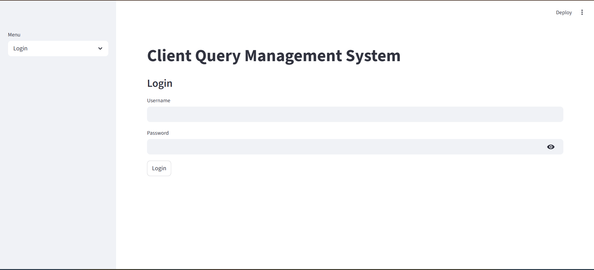
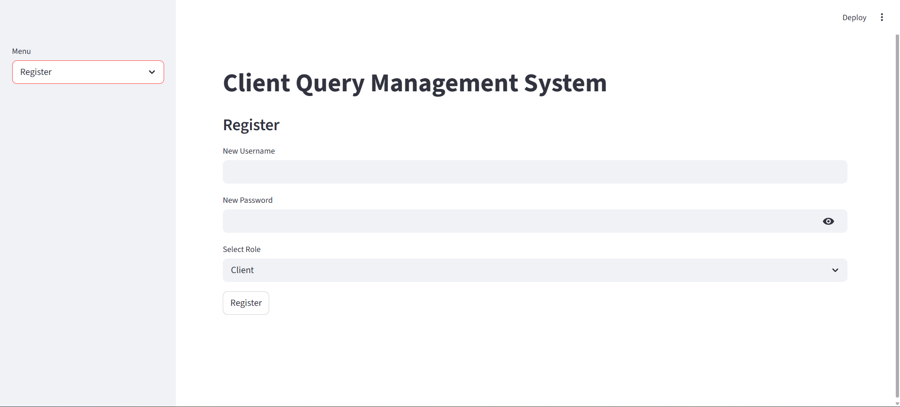
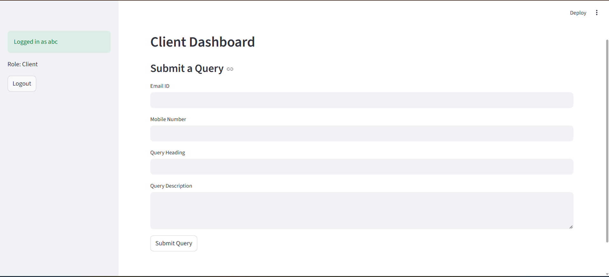
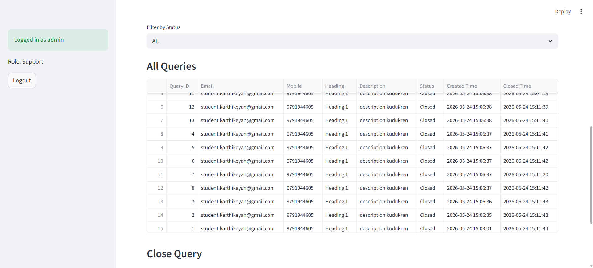
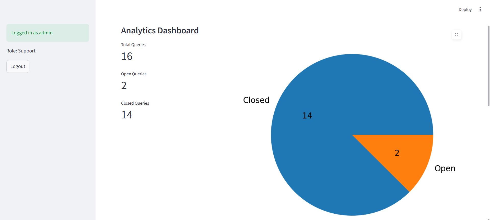

# Client Query Management System

A web-based support ticket management system built using Python, MySQL, and Streamlit.

The application allows:
- Clients to submit support queries
- Support teams to manage and close queries
- Real-time analytics and monitoring

---

# Features

## Authentication System
- User Registration
- Secure Login
- Password Hashing using SHA-256
- Role-Based Access
  - Client
  - Support

---

## Client Dashboard
Clients can:
- Submit support queries
- Enter:
  - Email ID
  - Mobile Number
  - Query Heading
  - Query Description
- View success/error validation messages

---

## Support Dashboard
Support team can:
- View all queries
- Filter queries by:
  - Open
  - Closed
- Close open queries
- View analytics dashboard

---

## Analytics Dashboard
Includes:
- Total Queries Count
- Open Queries Count
- Closed Queries Count
- Pie Chart Visualization

---

# Technologies Used

| Technology | Purpose |
|---|---|
| Python | Backend Logic |
| Streamlit | Frontend UI |
| MySQL | Database |
| Pandas | Data Handling |
| Matplotlib | Charts |
| hashlib | Password Hashing |

---

# Project Structure

```text
client_query_management_system/
│
├── app.py
├── auth.py
├── db.py
├── query_operations.py
├── requirements.txt
├── README.md
│
├── database/
│   └── schema.sql
```

---

# Database Schema

## Users Table

| Column | Type |
|---|---|
| id | INT |
| username | VARCHAR |
| hashed_password | VARCHAR |
| role | VARCHAR |

---

## Queries Table

| Column | Type |
|---|---|
| query_id | INT |
| mail_id | VARCHAR |
| mobile_number | VARCHAR |
| query_heading | VARCHAR |
| query_description | TEXT |
| status | VARCHAR |
| query_created_time | DATETIME |
| query_closed_time | DATETIME |

---

# Installation

## Clone Repository

```bash
git clone <your-repository-link>
```

---

## Create Virtual Environment

```bash
python -m venv venv
```

---

## Activate Environment

### Windows

```bash
venv\Scripts\activate
```

### Linux/Mac

```bash
source venv/bin/activate
```

---

## Install Dependencies

```bash
pip install -r requirements.txt
```

---

# Configure MySQL

Create database:

```sql
CREATE DATABASE client_query_system;
```

Use database:

```sql
USE client_query_system;
```

Execute `schema.sql`.

---

# Run Application

```bash
streamlit run app.py
```

---

# Validation Features

## Email Validation
- Checks proper email format

## Mobile Validation
- Only digits allowed
- Must contain 10 digits

---

# Screenshots

## Login Page

Add screenshot here:

```md

```

---

## Register Page

```md

```

---

## Client Dashboard

```md

```

---

## Support Dashboard

```md

```

---

## Analytics Dashboard

```md

```

---

# Future Improvements

- Query Priority Levels
- Query Categories
- Client Query Tracking
- Export to CSV
- Advanced Analytics
- Email Notifications
- Search Functionality
- Admin Dashboard

---

# Learning Outcomes

This project demonstrates:
- CRUD Operations
- Authentication Systems
- Database Connectivity
- Role-Based Access Control
- Streamlit Web Development
- Data Visualization
- Input Validation

---

# Author

Dineshkumar